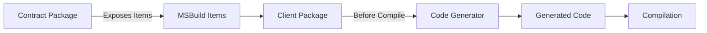
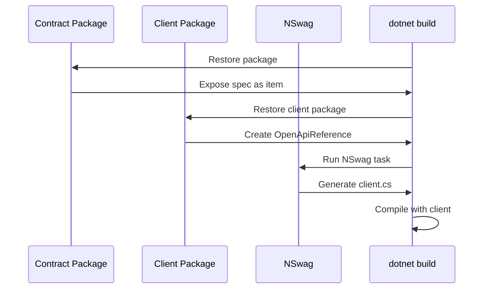
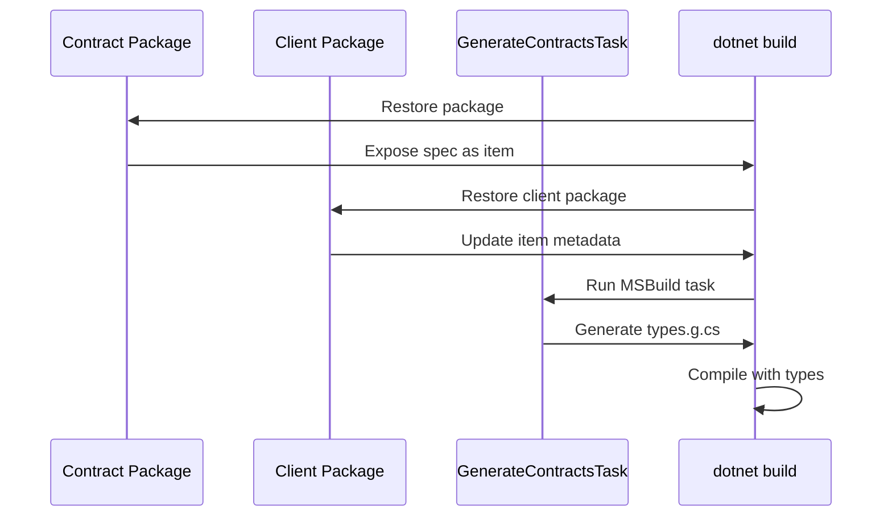

# 🏗️ Core Concepts

Understanding ConcordIO's key concepts will help you use it effectively. This guide explains the fundamental building blocks.

## 📦 Contract Packages

**What**: NuGet packages containing API specification files

**Purpose**: Distribute and version API contracts

**Contents**:
- Specification files (OpenAPI, AsyncAPI, or Proto)
- MSBuild `.targets` files
- Metadata (version, authors, description)

**Structure**:
```
MyApi.Contract.1.0.0.nupkg
├── openapi/
│   └── api.yaml              # Spec file(s)
├── build/
│   └── MyApi.Contract.targets  # MSBuild integration
├── buildTransitive/
│   └── MyApi.Contract.props    # Transitive imports
└── contentFiles/
    └── any/any/
        └── api.yaml          # IDE support
```

**Key Point**: Contract packages are **content-only** — they don't contain code, just specs and build logic.

### Exposed MSBuild Items

Contract packages expose specs as MSBuild items:

```xml
<!-- OpenAPI and Proto specs -->
<ConcordIOContract Include="path/to/spec.yaml" Kind="openapi" />

<!-- AsyncAPI specs -->
<ConcordIOAsyncApiContract Include="path/to/spec.yaml" />
```

These items are automatically available to consuming projects.

## 🎨 Client Packages

**What**: Development dependency packages that generate code from contracts

**Purpose**: Automatic client/type generation at build time

**How it Works**:
1. References the contract package
2. Wires specs to code generators
3. Runs before compilation

**For OpenAPI**:
```
MyApi.Contract.Client.1.0.0.nupkg
├── build/
│   └── MyApi.Contract.Client.targets  # Wires to NSwag
└── ...
```

Creates `<OpenApiReference>` items → NSwag generates C# clients

**For AsyncAPI**:
```
MyApi.Contract.Client.1.0.0.nupkg
├── build/
│   └── MyApi.Contract.Client.targets  # Wires to ConcordIO.AsyncApi.Client
└── ...
```

Updates `<ConcordIOAsyncApiContract>` metadata → Task generates C# types

**Key Point**: Client packages are **development dependencies** — they affect build but don't ship with your app.

## 🔍 Specification Kinds

ConcordIO supports three specification types:

### OpenAPI (REST APIs)

**Format**: JSON or YAML  
**Use Case**: REST/HTTP APIs  
**Code Generation**: NSwag (C# client classes)

**Example**:
```bash
concordio pack --spec api.yaml:openapi --package-id My.Api --version 1.0.0
```

**Generated Client**:
```csharp
var client = new MyApiClient(httpClient);
var result = await client.GetUsersAsync();
```

### AsyncAPI (Messaging)

**Format**: JSON or YAML  
**Use Case**: Event-driven/messaging (MassTransit)  
**Code Generation**: ConcordIO.AsyncApi.Client (C# message types)

**Example**:
```bash
concordio pack --spec events.yaml:asyncapi --package-id My.Events --version 1.0.0
```

**Generated Types**:
```csharp
public class OrderCreatedEvent
{
    public Guid OrderId { get; set; }
    public DateTimeOffset Timestamp { get; set; }
}
```

### Protocol Buffers (gRPC)

**Format**: `.proto` files  
**Use Case**: gRPC services  
**Code Generation**: Consumer-specific (Grpc.Tools)

**Example**:
```bash
concordio pack --spec service.proto:proto --package-id My.Grpc --version 1.0.0 --client false
```

**Key Point**: Proto contracts are distributed but code generation is typically done by consumers using `Grpc.Tools`.

## 🔄 Breaking Changes

**What**: Modifications to contracts that break existing consumers

**Detection**: Compare new spec against published version using oasdiff

**Examples of Breaking Changes**:
- Removing endpoints or operations
- Removing required fields
- Changing field types
- Removing enum values
- Making optional fields required

**Non-Breaking Changes**:
- Adding new endpoints
- Adding optional fields
- Adding enum values
- Changing descriptions

**Command**:
```bash
concordio breaking --spec api.yaml --package-id My.Api --version 1.0.0
```

**Exit Codes**:
- `0` = No breaking changes (safe to release)
- `1` = Breaking changes detected (requires major version bump)

**Key Point**: Breaking change detection helps enforce semantic versioning.

## 📚 Package Versioning

ConcordIO follows **Semantic Versioning (SemVer)**:

```
MAJOR.MINOR.PATCH
  │     │     │
  │     │     └─ Bug fixes, non-breaking changes
  │     └─────── New features, backward compatible
  └───────────── Breaking changes
```

**Strategy**:
1. Check for breaking changes: `concordio breaking`
2. If breaking → bump MAJOR
3. If new features → bump MINOR  
4. If fixes only → bump PATCH

**Example Workflow**:
```bash
# Current version: 1.2.3
# New spec has breaking changes

concordio breaking --spec api-v2.yaml --package-id My.Api --version 1.2.3
# Exit code: 1 (breaking changes detected)

# Bump to 2.0.0
concordio pack --spec api-v2.yaml --package-id My.Api --version 2.0.0
```

**Key Point**: Breaking detection + SemVer = predictable upgrades for consumers.

## 🔧 MSBuild Integration

ConcordIO integrates deeply with MSBuild for automatic code generation.

### How It Works



### MSBuild Targets

Contract packages provide targets that run at specific points:

```xml
<!-- In Contract package -->
<Target Name="ConcordIOAddContractItems" BeforeTargets="ResolveReferences">
  <ItemGroup>
    <ConcordIOContract Include="openapi/api.yaml" Kind="openapi" />
  </ItemGroup>
</Target>
```

Client packages hook into the build:

```xml
<!-- In Client package -->
<Target Name="ConcordIOGenerateClient" BeforeTargets="CoreCompile">
  <!-- Wire to NSwag or custom task -->
</Target>
```

**Key Point**: Everything happens automatically during `dotnet build`.

## 🌐 Multi-Spec Packages

A single package can contain multiple spec types:

```bash
concordio pack \
  --spec api.yaml:openapi \
  --spec events.yaml:asyncapi \
  --spec service.proto:proto \
  --package-id My.Service \
  --version 1.0.0
```

**Use Case**: Services that expose multiple protocols

**Package Structure**:
```
My.Service.1.0.0.nupkg
├── openapi/
│   └── api.yaml
├── asyncapi/
│   └── events.yaml
├── proto/
│   └── service.proto
└── build/
    └── My.Service.targets  # Exposes all specs
```

**Key Point**: Consumers can reference all contracts in one package.

## 🚀 Code Generation Flow

### OpenAPI Flow



### AsyncAPI Flow



**Key Point**: Generation is automatic and deterministic — same input always produces same output.

## 🎯 Dependency Model

### Contract Package Dependencies

Contract packages typically have **no dependencies** (content-only).

### Client Package Dependencies

Client packages declare:
1. Dependency on contract package (same version)
2. Dependency on code generator package

**OpenAPI Client**:
```xml
<PackageReference Include="MyApi.Contract" Version="1.0.0" />
<PackageReference Include="NSwag.MSBuild" Version="14.0.0" />
```

**AsyncAPI Client**:
```xml
<PackageReference Include="MyApi.Contract" Version="1.0.0" />
<PackageReference Include="ConcordIO.AsyncApi.Client" Version="0.1.0" />
```

**Key Point**: Client packages pull in everything needed for code generation.

## 🔐 Development Dependencies

Client packages are marked as **development dependencies**:

```xml
<developmentDependency>true</developmentDependency>
```

**What this means**:
- Used during build
- Not included in consuming package's dependencies
- Don't ship with your application

**Why it matters**: Consumers don't inherit your code generation tools.

## 📋 Summary

| Concept | Purpose | Key Point |
|---------|---------|-----------|
| **Contract Package** | Distribute specs | Content-only, versioned |
| **Client Package** | Generate code | Development dependency |
| **Spec Kinds** | Different protocols | openapi, asyncapi, proto |
| **Breaking Changes** | Detect incompatibilities | Enforce SemVer |
| **MSBuild Integration** | Automatic generation | Happens during build |
| **Multi-Spec** | Multiple protocols | One package, all contracts |

## Next Steps

Now that you understand the concepts:

- [🚀 Quick Start Guide](./quick-start.md) - Try it yourself
- [📝 Tutorial: Publishing Your First Contract](../tutorials/publishing-first-contract.md) - Step-by-step walkthrough
- [🛠️ CLI Tool Guide](../user-guides/cli-tool.md) - Command reference
- [🎨 Client Customization](../user-guides/client-customization.md) - Customize generated code

## Questions?

- [❓ FAQ](../troubleshooting/faq.md)
- [🐛 Common Issues](../troubleshooting/common-issues.md)
- [GitHub Discussions](https://github.com/LevDevIO/ConcordIO/discussions)
